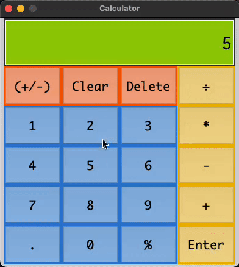

# Python-Calculator

This is a calculator program that I have created using Python/Pycharm/Tkinter

This calculator only performs simple calculations

Implemented: list, match, for

Thank you for viewing!

Gif of me using Calculator

